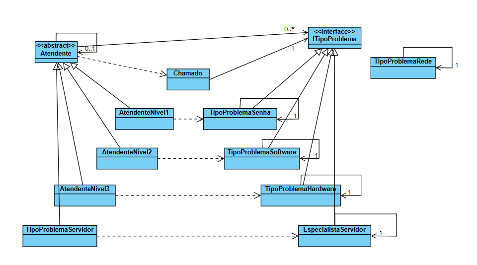

# Padrão de Projeto: Chain of Responsibility (Help Desk)

Este repositório demonstra a aplicação do padrão de projeto comportamental **Chain of Responsibility** (Cadeia de Responsabilidade).

O código utiliza um cenário específico e prático: um sistema de escalonamento de chamados (tickets) para um Help Desk de TI, onde cada nível de suporte representa um "elo" da cadeia.

## O Padrão Chain of Responsibility

O Chain of Responsibility é um padrão que permite passar solicitações ao longo de uma cadeia de "handlers" (tratadores). Ao receber uma solicitação, cada handler decide se:
1.  Pode processar a solicitação.
2.  Deve passá-la para o próximo handler na cadeia.

Isso desacopla o remetente da solicitação (quem cria o chamado) de seus receptores (quem o resolve), e múltiplos objetos têm a chance de tratar a solicitação sem que o remetente precise saber quem exatamente irá resolvê-la.

## Help Desk de TI

Neste exemplo, é modelado um fluxo de suporte técnico onde um chamado é escalonado por diferentes níveis de atendentes até que um deles consiga resolvê-lo.

* **A Solicitação (Request):** É um `Chamado` (ticket de suporte).
* **O Tipo da Solicitação:** É o `TipoProblema` (Senha, Software, Hardware, Servidor).
* **O Handler Abstrato:** É a classe `Atendente`, que define a estrutura da cadeia.
* **Os Handlers Concretos:** São os diferentes níveis de suporte:
    * `AtendenteNivel1`
    * `AtendenteNivel2`
    * `AtendenteNivel3`
    * `EspecialistaServidor`

## A Estrutura da Cadeia

A cadeia é montada ligando cada atendente ao seu "superior" (o próximo elo). A ordem de escalonamento é a seguinte:

**1. `AtendenteNivel1` (Início da cadeia)**
* **Se** o problema for `TipoProblemaSenha`, ele resolve.
* **Senão,** passa para o `AtendenteNivel2`.

**2. `AtendenteNivel2`**
* **Se** o problema for `TipoProblemaSoftware`, ele resolve.
* **Senão,** passa para o `AtendenteNivel3`.

**3. `AtendenteNivel3`**
* **Se** o problema for `TipoProblemaHardware`, ele resolve.
* **Senão,** passa para o `EspecialistaServidor`.

**4. `EspecialistaServidor` (Fim da cadeia)**
* **Se** o problema for `TipoProblemaServidor`, ele resolve.
* **Senão,** como não há superior (`null`), a solicitação termina como **"Sem Solução"**.

## Diagrama de Classes

